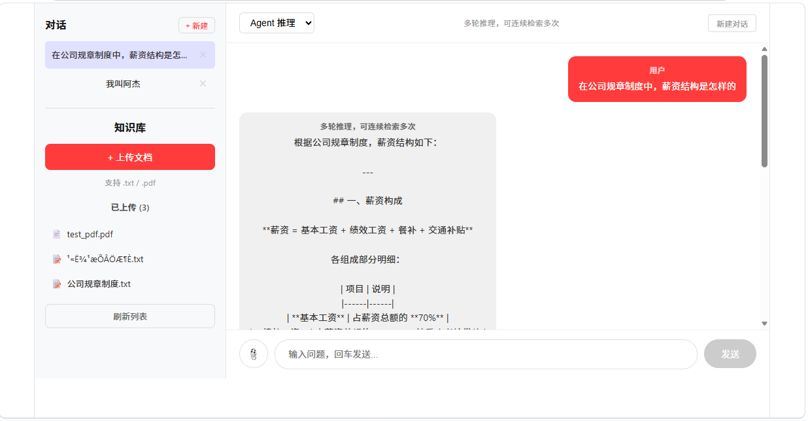

# AI 知识库问答系统

基于 RAG + Tool Calling + Agent + **LangGraph** 的智能知识库问答系统，支持文档上传、向量检索、多模式对话和多会话管理。

## 功能

### 文档管理
- 上传 txt / pdf 文档，自动文本提取、切分、向量化存入 Chroma
- 文档列表查看与删除
- 支持中文文本最优切分

### 四种对话模式
| 模式 | 说明 | 实现方式 |
|------|------|----------|
| **RAG 模式** | 固定流程：检索知识库 → 结合文档回答 | LCEL 链式调用 |
| **Agent 模式** | 模型自主判断是否需要检索，无需检索时直接回答 | `@tool` + `bind_tools` + if/else 单轮判断 |
| **Agent 推理** | 多步推理循环，模型可连续调用多次工具直到找到答案 | `@tool` + `bind_tools` + 手写 while 循环 |
| **LangGraph Agent** | 图结构替代手写 while，框架自动管理循环和状态 | StateGraph + ToolNode + tools_condition |

### 多会话管理
- 对话列表持久化，支持新建 / 切换 / 删除会话
- 每个会话独立 session_id，后端记忆互不干扰
- 四种对话模式共享同一会话记忆

### 流式输出
- 所有对话端点均为 SSE 流式响应
- 前端 ReadableStream 逐字渲染

## 技术栈

| 层级 | 技术 |
|------|------|
| 大模型 | DeepSeek (`deepseek-chat`) |
| Embedding | 硅基流动 `BAAI/bge-large-zh-v1.5` |
| 框架 | FastAPI + LangChain |
| 向量库 | Chroma |
| 前端 | Vue 3 + Vite + Axios |
| PDF 解析 | PyMuPDF |

## 项目结构

```
ai-knowledge-base/
├── backend/
│   ├── main.py                      # FastAPI 入口
│   ├── config/ai_conf.py            # 模型配置
│   ├── routers/kb.py                # API 路由
│   ├── services/
│   │   ├── rag_service.py           # RAG / Tool Calling / Agent / LangGraph / 临时文件分析
│   │   ├── doc_service.py           # 文档切分 / 向量化 / 检索 / 删除
│   │   └── tools.py                 # Tool Calling 工具定义
│   ├── agent_langgraph.py           # LangGraph 独立演示（StateGraph + ToolNode）
│   ├── schemas/kb.py                # Pydantic 请求模型
│   └── utils/response.py            # 统一响应格式
├── frontend/
│   └── src/views/KnowledgeBase.vue   # 主界面（四模式切换 + 流式渲染）
├── .env.example                      # 环境变量模板
└── requirements.txt
```

## 本地运行

### 1. 环境准备

```bash
# Python 3.10+
python -m venv .venv
.venv/Scripts/activate   # Windows
# source .venv/bin/activate   # macOS/Linux

pip install -r requirements.txt
```

### 2. 配置 API Key

```bash
cp .env.example .env
# 编辑 .env，填入你的 DeepSeek 和硅基流动 API Key
```

### 3. 启动后端

```bash
cd backend
uvicorn main:app --host 127.0.0.1 --port 8010 --reload
```

### 4. 启动前端

```bash
cd frontend
npm install
npm run dev
```

访问 http://127.0.0.1:5173

## API 端点

| 方法 | 路径 | 说明 |
|------|------|------|
| POST | `/api/kb/upload` | 上传文档（txt/pdf），自动入库 |
| GET | `/api/kb/documents` | 列出已上传文档 |
| DELETE | `/api/kb/documents/{filename}` | 删除文档及对应向量 |
| POST | `/api/kb/chat` | RAG 模式流式问答 |
| POST | `/api/kb/chat/agent` | Agent 单轮 Tool Calling 流式问答 |
| POST | `/api/kb/chat/agent/reasoning` | Agent 多轮推理流式问答 |
| POST | `/api/kb/chat/agent/langgraph` | LangGraph Agent 流式问答（图结构替代手动 while） |
### 请求示例

```json

{
  "question": "什么是 RAG？",
  "session_id": "session_123"
}
```

## 截图


